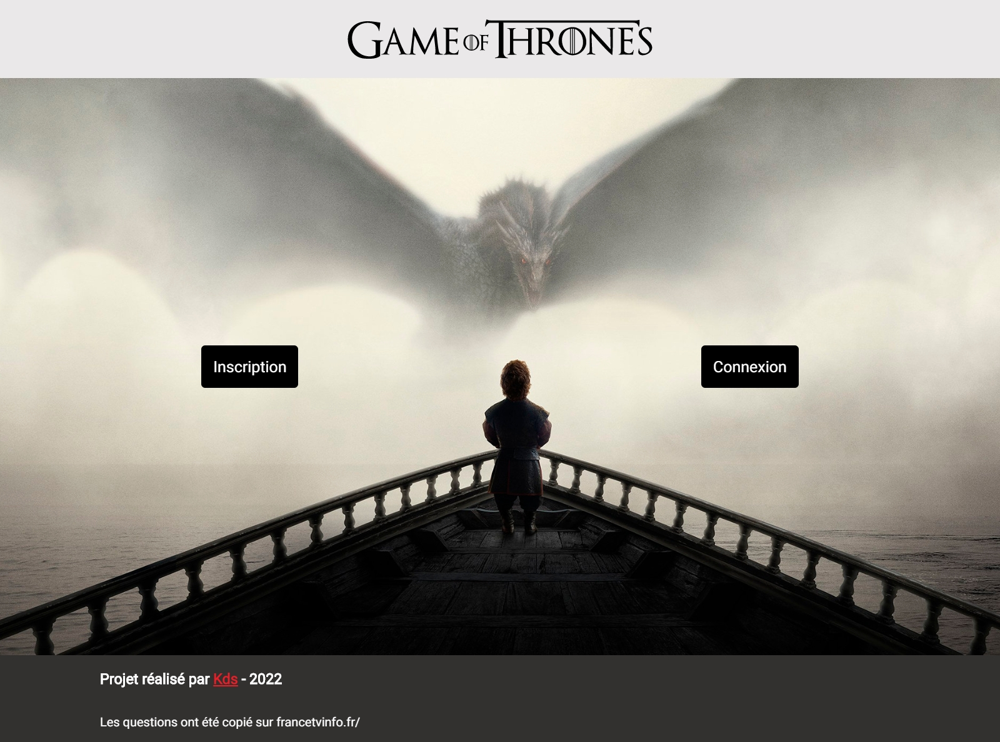
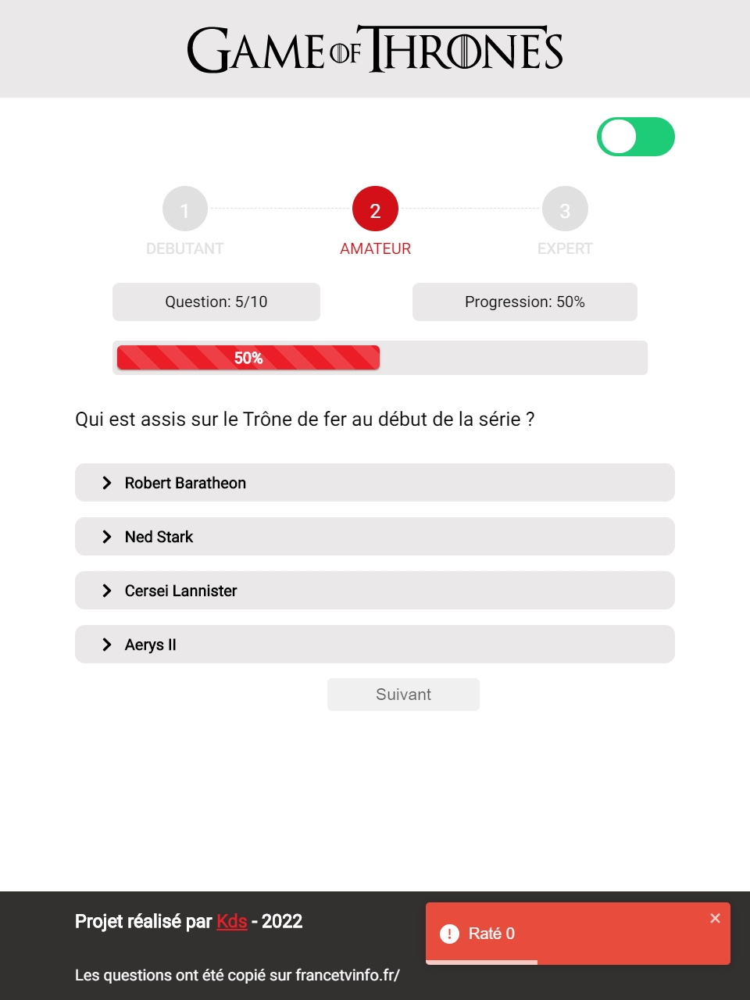

# GOT Quiz APP

[](https://twitter.com/kds_JS)


### Il s'agit d'un questionnaire sur la série Games Of Thrones.

## Fonctionnement
- [] Inscription , Connexion et Récupération de mot de passe 
- [] Avant tout, créer un compte et connectez vous pour accéder au quiz.
- [] Fonctionnement du jeu
        - C'est un Questionnaire à Choix Multiple (QCM)
        - Le questionnaire est constitué de trois niveau (débutant, amateur et expert)
        - 10 questions pour chaque niveau
        - Pour chaque question, vous auriez quatres propositions de réponses
        - Pour débloquez le niveau suivant, donnez au moins 5 bonnes réponses


[](https://twitter.com/kds_JS)


## [Démo en Direct](https://got-quiz-eight.vercel.app/)

## Languages et outils utilisés 
 - React 
 - SCSS
 - Firebase
 - React Router v6
 - React Toastify
 - React Icons
 - React Steps Horizontal


### Cloner le repo github

```sh
git clone https://github.com/Kds-JS/GOT-quiz.git
```

## Contact

Kds - [@twitter](https://twitter.com/kds_JS) 

Lien du Projet: [https://github.com/Kds-JS/GOT-quiz.git])
